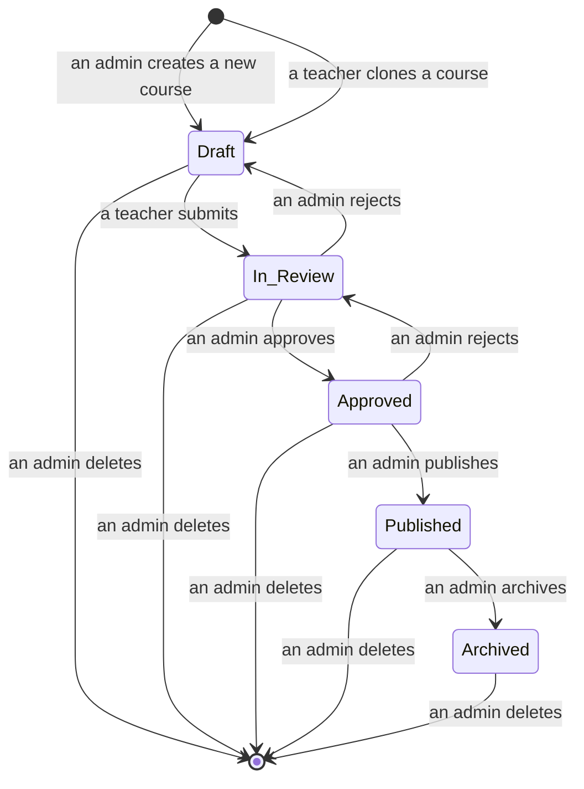

[Back to Overview](README.md)

# Course

A **Course** provides systematic knowledge and practice in reading, writing, listening, speaking, grammar and vocabulary, for particular topic at a particular English level.

A course is a collection of lessons.

A course has following characteristics:

- Created by admin.
- Have a a set of lessons associated with it.
- Can be assigned to teachers for modifications.
- Designed by teachers who are are granted access (by admin).
- Reviewed and published by admin.
- Published courses can be assigned to students.
- Assigned students can study the course.
- Progress of study is tracked.
- Courses are ranked based on difficulty.

Lessons are ordered: all lessons are initially locked except the first one, a lesson is only unlocked if the student has finished (all) the previous lesson(s).

Students need to meet reviewing requirements before they can procceed with new lessons/decks.

### Course status, version, and instance

A course can be in one of the following `status`es:

- `DRAFT`: the course is being composed/edited and not yet submitted for review
- `IN_REVIEW`: the course has been submitted to admins for review
- `APPROVED`: the course has been approved by (at least) one of the admins
- `PUBLISHED`: the course has been published (i.e. available for studying)
- `ARCHIVED`: the course has been archived (i.e. no longer available for studying)

Description:

- When a new course first get created, it will have `status` of `DRAFT`. The responsible teacher can edit this course.
- After the responsible teacher submits the course for review, the `status` will change to `IN_REVIEW`. Hereafter, the teacher can no longer edit the course.
- If an admin rejects an `IN_REVIEW` course, the status will change back to `DRAFT`, and the responsible teacher can edit the course again.
- If an admin approves the course, the `status` will change to `APPROVED`. At this stage, admins still cannot assign the course to any students for studying.
- If an admin `publish` an `APPROVED` course, the `status` will change to `PUBLISHED` and admins can assign the course to students.
- Only one course among courses with the same name can be `PUBLISHED`. The previous `PUBLISHED` course, if existed, will be changed to `ARCHIVED`, if a new course with the same name get published. Course assignment table (i.e. `COURSE_STUDENT`) will be updated to replace the previously `PUBLISHED` course with the newly `PUBLISHED` course. `ARCHIVED` courses cannot be assigned to students for studying.

Notes:

- Teachers may create a `DRAFT` course by copying a course of any status to which he/she has permission. The database row will be copied except for the `id`.
- Courses of `DRAFT`, `IN_REVIEW` or `APPROVED` status will be automatically deleted if not modified for more than 6 months. Notification of deletion will be sent to stakeholders (e.g. via email). Warning notitication will be sent one month before that.

# Lessons

A standard lesson includes:

- title
- text with images
- audio of text
- translation of text
- words
- grammar
- exercises

A video lesson includes:

- title
- video with subtitles
- translation of subtitles
- words section
- grammar section
- exercise section

Each lesson also has a corresponding Spaced-Repetition flash-cards decks for reviewing vocabulary and grammar.

# Decks

Each deck corresponds to a course.  
Each deck includes a set of sub-decks.
Each sub-deck corresponds to a lesson in the course.  
All sub-decks are initially locked: a sub-deck will be unlocked for reviewing once the student has finished the corresponding lesson.

## Sub-deck

Each sub-deck includes a set of flash-cards.

## Flash-card

Each flash-card includes a front and a back.

### Front

The front displays sentences that contain the targeted words/phrases, with accompanying audio/video.  
Targeted words are highlighted.

> Note for teacher:  
> The sentences should be long enough to provide a 'good' context, but should not be too long.  
> A targeted word/phrase should be in many cards, depending on difficulty, for better retention. However, there should only be one or two targeted words/phrases in any given card. If there are more than two words that are either new or not already in 'enough' cards, try search for those words in other sentences (maybe in other lessons/courses).

### Back

The back displays set of explanation of the targeted words.

## Scheduling

## Reviewing requirement
