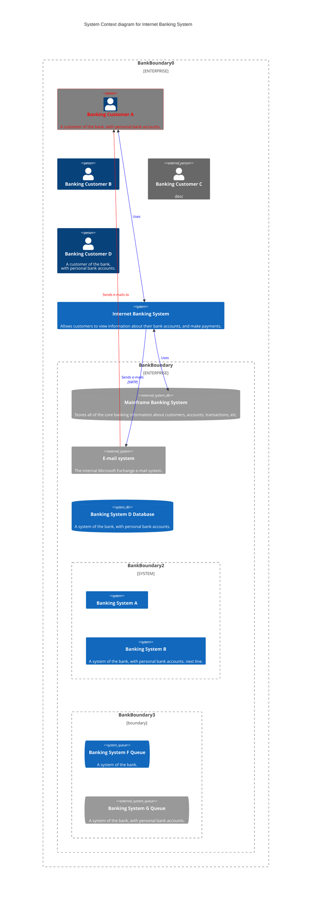

# Overview

The ENDEAVOR application is a web application that provides 3 main functionalities for 3 types of users:
+ Students can study English courses.
+ Teachers can modify English courses.
+ Admins can manage students, teachers, and the courses.

The __online courses__ are mainly used as complementary materials for offline courses provided by Endeavor English Center (ECC).

[Course](Course.md)

# Users and Functionalities
## Admin functionalities
Admins can: 
+ create courses
+ preview all courses
+ modify all courses
+ grant teachers permission to preview and submit change requests for courses
+ approve change requests from teachers
+ publish/unpublish a course
+ grant students (learning) access to courses
+ study all courses
## Teachers 
Teachers are EEC employees.  
For courses that admins grant access to, a teacher can:
+ preview content of the course
+ make a modified verision of the course
+ submit a change request to admins
## Students 
Students are mainly EEC students.  
A student will be provided access to an online course free-of-charge if he/she has registered the corresponding offline course. He/she then can:
+ study the course

