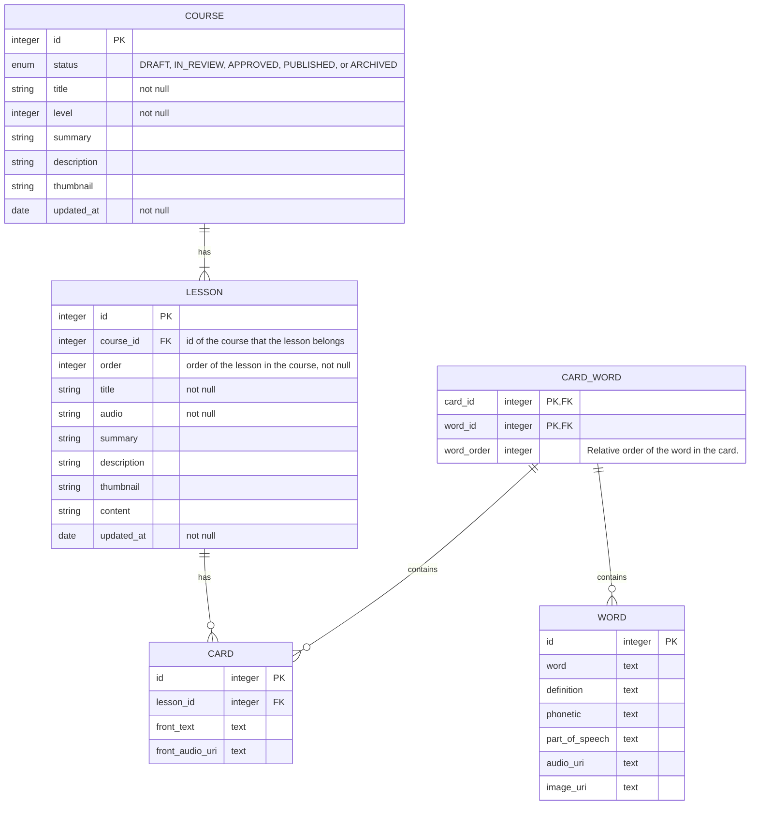

# Lessons

```mermaid
erDiagram
  COURSE ||--|{ LESSON: has
  LESSON ||--o{ CARD : has
  CARD_WORD ||--o{ WORD : contains
  CARD_WORD ||--o{ CARD : contains

  COURSE {
    integer id            PK
    enum    status            "DRAFT, IN_REVIEW, APPROVED, PUBLISHED, or ARCHIVED"
    string  title             "not null"
    integer level             "not null"
    string  summary
    string  description
    string  thumbnail
    date    updated_at        "not null"
  }

  LESSON {
    integer id            PK
    integer course_id     FK  "id of the course that the lesson belongs"
    integer order             "order of the lesson in the course, not null"
    string  title             "not null"
    string  audio             "not null"
    string  summary
    string  description
    string  thumbnail
    string  content
    date    updated_at        "not null"
  }

  CARD {
    id              integer   PK
    lesson_id       integer   FK
    front_text      text
    front_audio_uri text
  }

  WORD {
    id              integer   PK
    word            text
    definition      text
    phonetic        text
    part_of_speech  text
    audio_uri       text
    image_uri       text
  }

  CARD_WORD {
    card_id         integer   PK,FK
    word_id         integer   PK,FK
    word_order      integer         "Relative order of the word in the card."
  }
```
