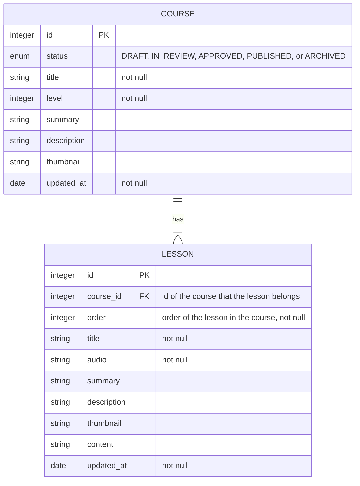

# Data Model

```mermaid
erDiagram
  COURSE ||--|{ LESSON: has

  COURSE {
    integer id            PK
    enum    status            "DRAFT, IN_REVIEW, APPROVED, PUBLISHED, or ARCHIVED"
    string  title             "not null"
    integer level             "not null"
    string  summary
    string  description
    string  thumbnail
    date    updated_at        "not null"
  }

  LESSON {
    integer id            PK
    integer course_id     FK  "id of the course that the lesson belongs"
    integer order             "order of the lesson in the course, not null"
    string  title             "not null"
    string  audio             "not null"
    string  summary
    string  description
    string  thumbnail
    string  content
    date    updated_at        "not null"
  }
```
