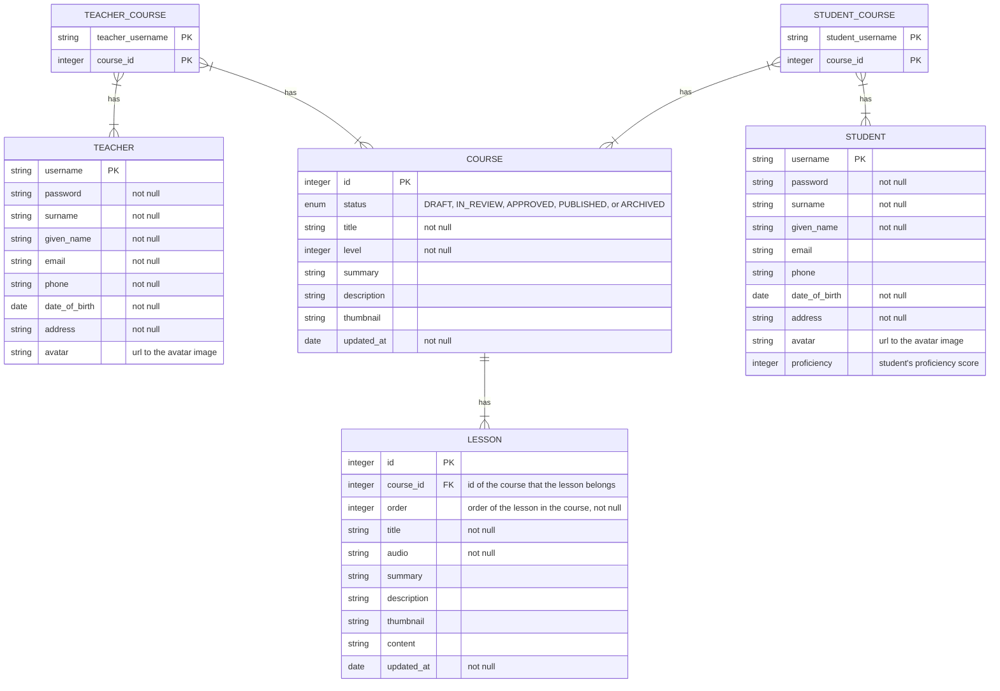
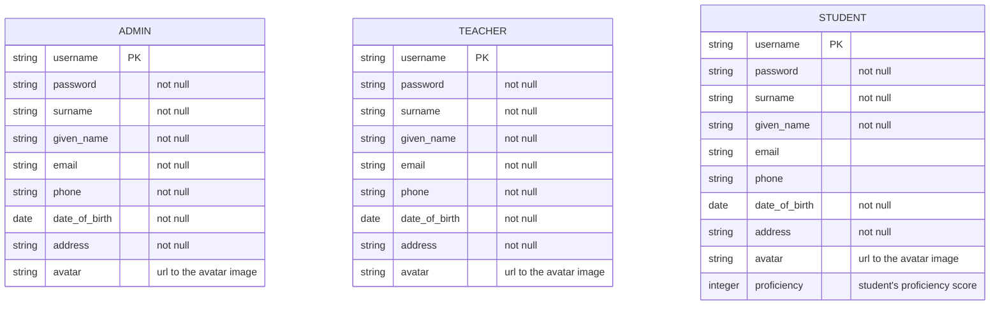

# Data Model

## Relational vs. Non-relational Data Model

There are a lots of many-to-many relationships.

- Words and Cards
- Students and Cards
- Students and Lessons
- Students and Courses
- Teachers and Courses
- etc.

Let's take `Words and Cards` as an example. In MongoDB, there are 2 ways you can do this.

- If you decide to go with `referencing` like in relational design, then for simply fetching words belong to a card 2 `lookup`s are needed and you still have problems with data integrity, since MongoDB doesn’t support foreign keys.
- If you decide to go with `embedding` and storing words in a card document as an array, then getting words in a card (from a student perspective) will be faster, but getting list of cards that a word belongs to (from a teacher perspective) will be very slow. You can store word ids in a card document and card ids in a word document, but then we have duplication and we need to deal with update/delete anomalies.

Even for current one-to-many relationships, as the app evolves

So it's better to use a RMDB with `json` support such as `PostgresSQL`.

## Overview

## Users

There are 3 sub-domains having independent authentication/authorization needs. Therefore, 3 separate database tables are used.  
Basic authentication is used, as it is simple but sufficient. Email is not chosen as login username because young students may not have emails. UUID is difficult to remember. So for each student, a unique username acts as both the primary key and the login username and is created as follows:

- Step 1: concatenate the user's given name and surname (in that order) with underscore "`_`" as separator.
- Step 2: if the username from step 1 is not unique, append an underscore "`_`" and a counter starting from `2`.

## Resources

See [Lesson](./Lessons/README.md) for more details.
