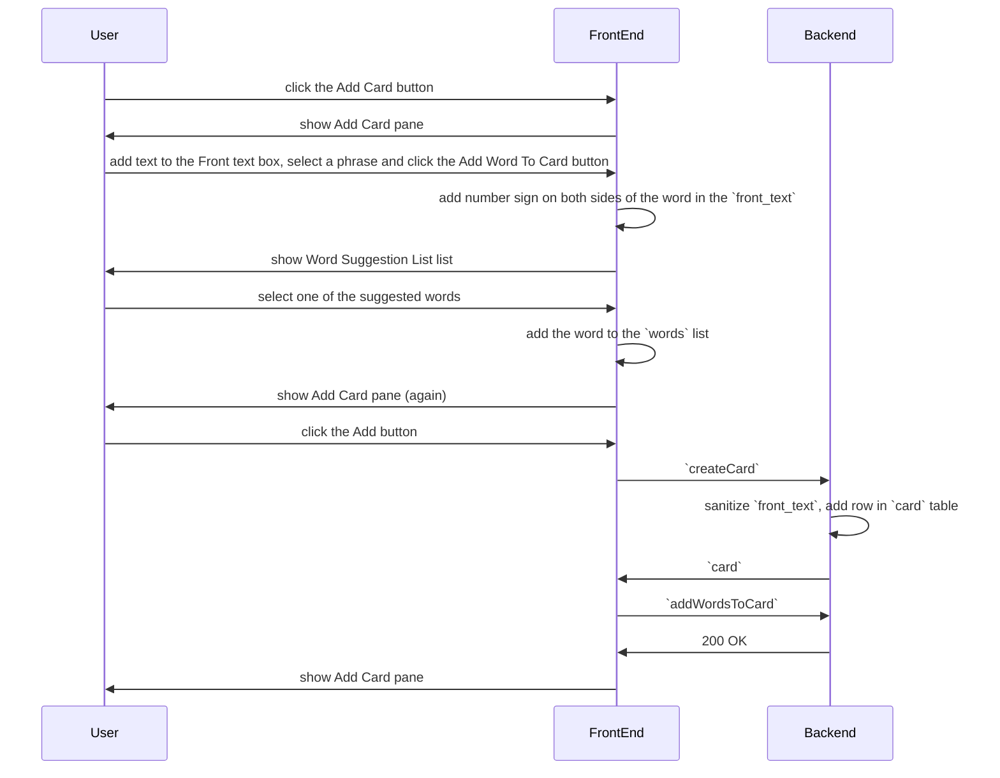

# Card

## Add

```mermaid
sequenceDiagram
    participant User
    participant FrontEnd
    participant Backend

    User ->> FrontEnd: click the Add Card button
    FrontEnd ->> User: show Add Card pane

    User ->> FrontEnd: add text to the Front text box, select a phrase and click the Add Word To Card button
    FrontEnd ->> FrontEnd: add number sign on both sides of the word in the `front_text`
    FrontEnd ->> User: show Word Suggestion List list
    User ->> FrontEnd: select one of the suggested words
    FrontEnd ->> FrontEnd: add the word to the `words` list
    FrontEnd ->> User: show Add Card pane (again)

    User ->> FrontEnd: click the Add button
    FrontEnd ->> Backend: `createCard`
    Backend ->> Backend: sanitize `front_text`, add row in `card` table
    Backend ->> FrontEnd: `card`
    FrontEnd ->> Backend: `addWordsToCard`
    Backend ->> FrontEnd: 200 OK

    FrontEnd ->> User: show Add Card pane
```
