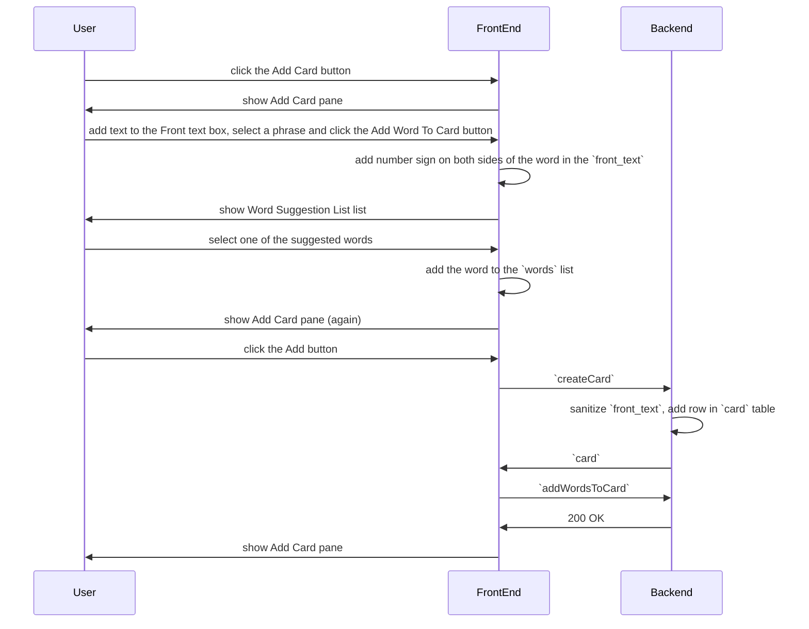

# Card

## Add

- user add text to the `Front` text box
- user select a word/phrase and click the `Add Word to Card` button (below the `Front` text box)
  - client adds `#` on both sides of the word in the front text (for highlighting)
  - client shows the `Word Suggestion List` below the `Add Word to Card` button with:
    - search field (editable)
    - result (populated with `searchWord` full-text search)
  - user selects one of the suggested words
    - client adds the word to the `words` list
  - click the `Add New Word` button instead
    - the `Add New Word` dialog is shown
    - enter word info and click `Add`
      - `createWord` is called
      - the word is added to `createCard` request body
- upload front audio (optional)
  - `uploadAudio` is called
  - the audio_uri is added to `createCard` request body
- user clicks the `Add` button
  - the front text is added to `createCard` request body
  - clients calls the rpc `createCard`
    - front text is sanitized (e.g. html tags are not allowed) to prevent XSS, etc.
    - row is added to `card` table
  - after `createCard` returns successfully, `addWordsToCard` is called
    - rows are added to `card_word` table
